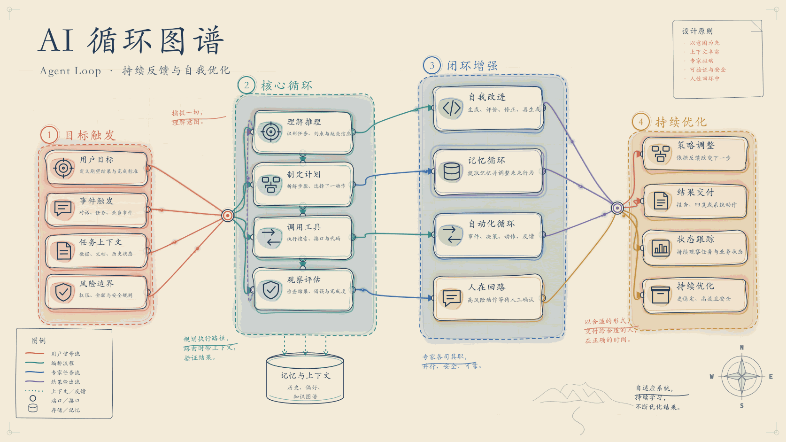

# Paper System Atlas

[](https://github.com/Adgai115/paper-system-atlas/actions/workflows/ci.yml)
[](https://www.npmjs.com/package/paper-system-atlas)

一个面向 Agent 的中文优先、纸张彩色手绘风格语义化系统地图工具、Skill 与可部署 CLI。

它从内容规格自动计算布局，以 SVG 作为主要可编辑格式，同时输出 PNG、JPG、GIF 和 Excalidraw。项目使用独立协议、场景模型、布局算法和渲染实现。

## 效果预览



## 快速开始

Windows：

```powershell
./scripts/setup.ps1
./scripts/render-example.ps1
```

Linux / macOS：

```bash
bash scripts/setup.sh
bash scripts/render-example.sh
```

如果只需要部署工具，不需要源码和测试，可生成紧凑安装包：

```powershell
npm run package:windows
npm install -g ./dist-package/paper-system-atlas-0.3.0.tgz
paper-atlas doctor
```

Linux / macOS 可生成同样的 npm 安装包；系统存在 `zip` 时还会生成 Skill 压缩包：

```bash
npm run package:unix
```

项目已配置为 public npm 包，并通过 GitHub Release 工作流执行带 provenance 的发布。正式版本发布后可直接安装：

```bash
npm install -g paper-system-atlas
paper-atlas doctor
```

命令同时生成 `build-animated-system-maps-skill.zip`。把它解压到 Codex skills 目录后，Skill 会优先使用源码仓库 CLI；脱离源码仓库时自动调用全局 `paper-atlas`。

生成分层、泳道和径向三种中文视觉回归样例：

```powershell
./scripts/render-visual-samples.ps1
# 如需同时检查三种布局的动画：
./scripts/render-visual-samples.ps1 -IncludeGif
```

也可以直接运行：

```powershell
npm install
npm run build
node dist/src/cli.js render `
  --spec examples/intelligent-collaboration.json `
  --outdir outputs `
  --basename demo `
  --formats svg,png,jpg,gif,excalidraw `
  --verify
```

一次生成分层、泳道和径向三种布局，并输出横向对比拼图：

```powershell
paper-atlas preview `
  --spec examples/intelligent-collaboration.json `
  --outdir outputs/preview `
  --basename collaboration `
  --verify
```

单独控制布局集合可使用 `--layouts layered,radial`。预览命令默认输出 PNG 和 SVG，并始终保留用于对比拼图的 PNG。

## Agent 自动化接口

v0.3 的重点是让其他 Agent 可以规划、调用、校验和接续处理，不依赖网页端。

先对原文或规格做低成本规划：

```powershell
paper-atlas plan --input examples/ai-loop-source.md
paper-atlas plan --spec examples/intelligent-collaboration.json
```

结果包含推荐的布局、主题、画布、格式、理由、风险、候选布局评分和下一条命令。主题预设为 `paper-color`、`blueprint`、`whiteboard`、`ink-wash`；画布预设为 `presentation`、`article`、`wechat`、`square`、`print-a4`。运行 `paper-atlas presets` 可读取完整 JSON 目录。

批量处理规格目录：

```powershell
paper-atlas batch `
  --input examples `
  --outdir outputs/batch `
  --layout auto `
  --formats svg,png,excalidraw
```

批处理默认逐项自动选择布局、主题和画布，并执行真实产物校验。无效规格不会阻断后续项目；最终状态、实际参数、文件路径、验证结果和单项错误统一写入 `batch-manifest.json`。

CLI 支持 `--input -` 和 `--spec -` 从标准输入读取。正常结果写入 stdout JSON，错误写入 stderr JSON；稳定退出码为 `1`（执行或验证失败）、`2`（参数或输入无效）、`3`（模型配置失败）、`4`（文件系统失败）。

```powershell
Get-Content -Raw examples/ai-loop-source.md | paper-atlas plan --input -
```

## 文档一键生成

`compose` 会把 Markdown 或 TXT 文档交给配置的模型，生成语义规格，经过 Zod 校验和自动修复后，再调用渲染引擎输出图像。这个入口补齐了“原文 → 规格 → 图像”的完整部署链路，不再需要人工编写 JSON。

```powershell
$env:PAPER_ATLAS_API_KEY = '<模型密钥>'
$env:PAPER_ATLAS_MODEL = '<模型名称>'

./scripts/compose.ps1 `
  -InputDocument examples/ai-loop-source.md `
  -Profile atlas-showcase `
  -OutDir outputs/compose `
  -BaseName ai-loop
```

模型适配配置：

- 默认调用 `https://api.openai.com/v1/responses`，使用严格 JSON Schema 输出。
- `PAPER_ATLAS_BASE_URL` 可切换到兼容端点。
- `PAPER_ATLAS_API_STYLE=chat-completions` 可切换到 `/chat/completions`。
- `PAPER_ATLAS_API_TIMEOUT_MS` 设置单次 HTTP 请求超时，默认 120000 毫秒。
- `PAPER_ATLAS_API_RETRIES` 设置超时、HTTP 408/409/425/429 和 5xx 的重试次数，默认 2 次。
- `PAPER_ATLAS_API_RETRY_DELAY_MS` 设置指数退避初始间隔，默认 500 毫秒；服务端 `Retry-After` 优先。
- 同时兼容 `OPENAI_API_KEY`、`OPENAI_MODEL` 和 `OPENAI_BASE_URL`。
- 密钥只从环境变量读取，不通过命令行参数传递。

生成的 `<basename>.atlas.json` 会和图像一起保存在输出目录。模型输出不合法时，命令会把中文校验错误反馈给模型并自动重试，最多三次；所有输出始终经过本地校验和真实文件验证。

HTTP 重试与模型语义修复分别计数。网络抖动、限流或暂时性服务错误不会消耗 `--max-attempts` 的语义修复次数。CLI 可通过 `--api-timeout-ms`、`--api-retries` 和 `--api-retry-delay-ms` 覆盖上述环境变量。

## 设计原则

- 中文优先，技术缩写按需保留。
- Agent、Skill 和插件调用是主要交互面，不要求浏览器 UI。
- 内容描述与视觉布局分离。
- SVG 是统一场景表达，Excalidraw 是必须支持的编辑出口。
- 纸张、墨线和彩色水洗是默认风格，主题字段允许完全自定义。
- 默认四阶段分层图采用窄—宽—宽—窄的非对称构图，并通过左右汇聚枢纽形成自然线束。
- 连线会在节点外寻找低冲突走廊，并以圆润手绘折线避开非端点节点。
- Windows、中文路径与无 FFmpeg 环境是一等使用场景。
- GIF 使用一次静态栅格化、共享调色板和轻量动态叠加；动态层包含信号拖尾、柔和光晕和目标节点响应，不重复执行每帧 SVG 水彩滤镜。

## 动画与性能

- SVG 动画保留可编辑路径，并用多级拖尾表达信号方向。
- GIF 缓存纸张、文字、节点和连线底图，只重绘移动信号与脉冲反馈。
- PNG、JPG 与 GIF 共用一次静态栅格化结果，避免同一幅水彩场景重复计算。
- 所有帧共用同一调色板，降低重复计算并避免逐帧色彩漂移。
- 分辨率、帧数和帧率仍由语义规格控制，性能优化不会自动降低输出质量。

## 视觉配置

`layout.profile` 支持两种工作方式：

- `adaptive`：默认自适应排版，适合任意分组、节点数量和三种布局。
- `atlas-showcase`：四阶段分层图的高保真展示模板，固定采用 1674×941 参考构图，并补全双汇聚点、内部编排链、记忆与上下文、图例、批注、设计原则、罗盘和山景。所有内容仍为可编辑 SVG/Excalidraw 元素，不嵌入参考位图。

`radial` 会生成可配置的中心枢纽。通过 `layout.hub` 设置标题、说明和颜色；未设置时使用图谱标题与副标题。跨分区连线会经过中心枢纽汇聚，组内连线仍保留直接关系。

`decorations` 可以覆盖展示模板的内容层：

- `principles`：右上角设计原则。
- `legend`：图例名称与连线类型。
- `support`：底部支撑系统标题与说明。
- `callouts`：绑定到分区的叙事批注。
- `compass`、`landscape`：控制装饰元素是否显示。

连线的 `label` 会同步写入 SVG 与 Excalidraw，适合标注 API、事件、数据或人工动作。

示例 `examples/intelligent-collaboration.json` 已启用 `atlas-showcase`；通过 CLI 使用 `--layout lanes` 或 `--layout radial` 时会自动回到 `adaptive`，以保持自动布局能力。

AI Loop 测试示例同时展示两种配置：

- `examples/ai-loop-atlas-showcase.json`：四阶段高保真展示图。
- `examples/ai-loop-adaptive.json`：六阶段径向反馈闭环。

## 质量检查

`--verify` 除了检查文件、尺寸、GIF 帧数和 Excalidraw 结构，还会执行场景质量检查：

- 节点与分区是否越界或重叠。
- 径向枢纽是否侵入外围分区。
- 连线是否穿过无关节点。
- 文字截断风险、画布密度、超长路径和连线标签碰撞。
- 主题墨色、辅助文字与语义色相对纸张背景是否达到 WCAG AA 4.5:1 对比度。

结构性问题会令命令失败；可读性风险记录在 `warnings` 中，便于继续调整规格而不误判文件损坏。

测试套件会校验 8 分区、64 节点、160 连线的规格上限，并使用 8 分区、32 节点、64 连线的高密度图在分层、泳道和径向三种布局上验证有限坐标、SVG 与 Excalidraw。GitHub Actions 会在 Windows、Linux 和 macOS 上执行构建、测试、真实渲染冒烟测试与 npm 打包检查。

## 当前状态

当前为原创 v0.3 开发版本。

## 许可证

Copyright (C) 2026 Adgai115。

本项目采用 [GNU General Public License v3.0 only](LICENSE) 开源。你可以在 GPL-3.0 的条款下使用、修改和分发本项目；分发修改版本时必须继续提供相应源代码并保留同一许可证。
